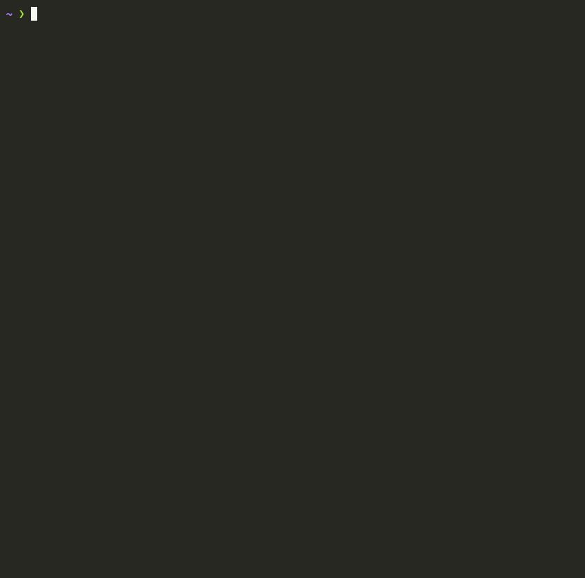

# battler

**Make your AI subscriptions debate each other, then get one consolidated answer.**

Claude, ChatGPT and Grok each answer your question, read each other's answers, argue, and revise.
Then they judge each other blind: every AI scores the others against the same checklist, and battler
averages the scores into one verdict with the best-supported answer, where they agree, where they still
disagree, and who argued best.

No API keys and no per-token bills. battler drives the official command-line tools you're already
signed in to, so every call uses the subscriptions you already pay for.



<details>
<summary>What a medium battle prints</summary>

```
$ battler "Should startups use microservices from day one?"

  Claude vs GPT vs Grok
  Should startups use microservices from day one?
  medium · 2 rounds · judged by a panel: Claude, GPT and Grok

  Round 1/2 · Opening statements
    ✓ Claude     14s  No. Most startups should begin with a well-structured modular…
    ✓ GPT        19s  Most startups should not use microservices from day one…
    ✓ Grok       14s  No. Startups should start with a well-structured modular…

  Round 2/2 · Rebuttals and revisions
    ✓ Claude     20s  No. Most startups should start with a modular monolith an…
    ✓ GPT        23s  Most startups should begin with a modular monolith, while…
    ✓ Grok       51s  No. A typical startup, meaning a small team still learnin…

  Verdict · judge panel
    ✓ Claude     15s
    ✓ GPT        30s
    ✓ Grok       41s

  ╭─ Verdict ───────────────────────────────────────────── strong agreement ─╮
  │                                                                          │
  │  No. Most startups, meaning small teams still discovering their product, │
  │  should start with a genuinely modular monolith: one deployment,         │
  │  enforced module interfaces, and owned schemas. …                        │
  │                                                                          │
  ╰──────────────────────────────────────────────────────────────────────────╯

  Agreed
  ✓ Default to a modular monolith. Microservices from day one is wrong for
    typical small startups.
  ✓ Microservices mainly solve multi-team coordination problems that small
    teams do not yet have.

  Still debated
  ≠ When to enforce boundaries versus when to extract
    Claude, GPT  Extract when measured pressure justifies it, having enforced
                 module boundaries in advance.
    Grok         Waiting for measurement can be too late. Data gravity makes
                 the first extraction costly.

  Scorecard
  GPT     ████████▌░  8.5   Modular monolith with a few justified day-one services.
  Grok    ████████░░  8.3   Modular monolith. Split only for nameable boundaries.
  Claude  ████████░░  8.0   Modular monolith first. Extract under measured pressure.

  Scored by Claude, GPT and Grok; no judge scored itself.

  ★ GPT wins  top score · first choice of 2 of 3 judges
    GPT and Grok each contributed the sharpest refinements…

  Report: battles/2026-09-29-should-startups-use-microservices.html
```

</details>

In a real terminal each debater has its own color, and progress updates live with spinners and timers.

## Requirements

- **macOS** (Linux will probably work but isn't tested yet; Windows isn't supported)
- Node.js 22 or newer
- At least **two** of these CLIs, each signed in with a subscription, **or just Cursor** (see below):

| Debater | CLI | Install | Sign in with |
|---|---|---|---|
| Claude | Claude Code (`claude`) | [claude.com/claude-code](https://claude.com/claude-code) | Claude Pro or Max: run `claude` and log in |
| GPT | Codex CLI (`codex`) | `npm install -g @openai/codex` | ChatGPT: `codex login` |
| Grok | Cursor CLI (`cursor-agent`) | `curl https://cursor.com/install -fsS \| bash` | Cursor: `cursor-agent login` |

### Which debaters you get

With no `--agents` flag, battler checks what's installed and logged in (`battler --doctor` shows the same):

| You have | Debaters |
|---|---|
| Claude Code, Codex and Cursor | Claude, GPT, Grok |
| Claude Code and Codex | Claude, GPT |
| Any one of Claude Code / Codex, plus Cursor | Cursor stands in for the missing one, e.g. Claude, GPT (via Cursor), Grok |
| Only Cursor | Claude (via Cursor), GPT (via Cursor), Grok |

Cursor can run models from several companies, so it can fill any gap (see [Cursor allowances](#cursor-allowances)
below: stand-ins draw on Cursor's "Other Models" allowance). You can also choose exactly who debates:

```bash
battler -a claude,codex "…"                                   # just Claude vs GPT
battler -a claude:opus,codex:gpt-5.5 "…"                      # with specific models
battler -a cursor:claude-sonnet-5-medium,cursor:gpt-5.5-medium,grok "…"   # all through Cursor
battler -a claude,cursor:gemini-3.7-flash-high "…"            # anything Cursor offers (`cursor-agent --list-models`)
```

## Install

```bash
npm install -g battler
battler setup
```

`battler setup` checks which AI CLIs you have, offers to install and log in to the missing ones (asking
before each step), saves your preferred length, and runs a one-minute test battle.

Or try it without installing: `npx battler "Is a hot dog a sandwich?"`

<details>
<summary>From source</summary>

```bash
git clone https://github.com/derekimp/battler.git && cd battler
npm install          # also builds dist/
npm link             # puts `battler` on your PATH
```
</details>

## Usage

```bash
battler                                               # asks for the topic and length, then offers follow-ups
battler "Is Rust better than Go for backend services?"
battler -s "Tabs or spaces?"                          # short: quick answer and winner, ~1 min
battler -L "Should we rewrite the monolith?"          # long: detailed verdict with strengths and weaknesses
battler -r 3 "Should we rewrite the monolith?"        # more debate rounds
battler --open "Should we rewrite the monolith?"      # open the report in your browser afterwards
battler -a claude,grok -j codex "Tabs or spaces?"     # choose debaters and a single judge
battler -a claude:opus,codex,grok:cursor-grok-4.6-xhigh "…"   # pick a model per debater
pbpaste | battler                                      # topic from stdin
```

### Follow-ups and more rounds

Every battle is saved, so you can keep it going:

```bash
battler continue "What if they mainly want to build websites?"   # follow-up question
battler continue                                                   # one more round, same topic
battler continue -r 2                                              # two more rounds
battler continue --from battles/2026-09-30-…-tabs-or-spaces.html "…"   # a specific battle, not the latest
```

- **A follow-up** is a new debate on your new question. Each AI first sees the earlier question, the judges'
  answer, its own final position and everyone else's, then argues the follow-up. Same debaters, same
  "Debater A/B/C" letters.
- **More rounds** continue the same debate from where it stopped: everyone rebuts the latest positions, then
  the judges score the whole debate again.
- Running plain `battler` in a terminal asks after each verdict: type a follow-up, `more` for another
  round, or press Enter to finish.

In a terminal the verdict is drawn as shown above. When stdout is piped, it's written as Markdown
(`battler "…" > answer.md`), and `--json` gives structured output for scripts.
Every battle also saves a report to `./battles/`: a web page (`.html`) with the verdict, scorecard and each
round side by side, the same as Markdown (`.md`), and the battle itself (`.json`) for `battler continue`. `--open` opens the web page when the battle finishes.

| Option | Default | |
|---|---|---|
| `-a, --agents` | every ready CLI | Debaters, comma-separated `name[:model]`. Names: `claude`, `codex` (or `gpt`), `grok`, or `cursor:<model>` |
| `-j, --judge` | `panel` (short: Claude) | `panel`: every debater judges. Or one agent, same format as `--agents` |
| `-l, --length` | medium | `short`, `medium` or `long` (shorthands `-s`, `-m`, `-L`). See below |
| `-r, --rounds` | 2 | Total rounds including the opening, 1-5 |
| `-o, --out` | `./battles` | Where reports are saved |
| `--open` | | Open the web report in your browser afterwards |
| `--from` | the latest battle | With `continue`: which battle to continue (its `.html`, `.md` or `.json`) |
| `--json` | | Print the verdict as JSON |
| `--doctor` | | Check each CLI is installed and on a subscription login |

### Lengths

| | Debaters write (opening / rebuttal) | Verdict shows |
|---|---|---|
| `short` | ~150 / 200 words | a 1-2 sentence answer, the winner, and scores |
| `medium` | ~350 / 450 words | an answer paragraph, what they agreed on, what's still debated, a scorecard, the winner |
| `long` | ~700 / 900 words | all of the above in more depth, plus each debater's strongest and weakest point |

Shorter battles are also faster. The saved transcript always has every round in full.

### Config file

Set defaults in `~/.config/battler/config.json` (or `$XDG_CONFIG_HOME/battler/config.json`). Every field is optional, and flags override it.

```json
{
  "agents": ["claude", "codex", "grok"],
  "judge": "panel",
  "open": true,
  "rounds": 2,
  "length": "medium",
  "out": "~/battles",
  "models": { "claude": "opus", "grok": "cursor-grok-4.6-xhigh" }
}
```

Model names are passed straight to each CLI. If one isn't available to your account, battler says so,
and for Grok it lists the models your Cursor plan offers.

## How a battle works

1. **Opening:** every debater answers the topic on its own, in parallel.
2. **Debate** (rounds 2+): each debater sees the others' latest positions, rebuts the weakest points, concedes what it should, and revises its own position.
3. **Verdict:** the judges return structured JSON: the answer, points of consensus, open disagreements, and a
   1-5 rating for each debater on a fixed checklist. battler renders it for the terminal, the web report,
   Markdown or `--json`.

### How scoring works

Each judge rates every debater from 1 to 5 on four criteria:

| Criterion | What it measures |
|---|---|
| Accuracy | Facts and claims are correct; no overclaiming |
| Reasoning | Logic, evidence and concreteness |
| Engagement | Deals with the other debaters' strongest points; concedes and pushes back well |
| Calibration | Stated confidence matches the evidence and the caveats |

The score out of 10 is computed by battler, not chosen by the judge: the four ratings added up and halved.

- **Panel** (default for medium and long): every debater also judges. With three or more debaters, a
  judge's ratings of itself are thrown away, so nobody marks their own homework. Ratings are averaged
  across judges.
- **The winner is the top of the scorecard**, the highest average score. The report also shows how many
  judges had that debater as their first choice. If the top scores tie, those first choices break the
  tie; if they're split too, it's a tie.
- **Single judge** (default for short, or `-j claude` etc.): one model rates everyone, which is cheaper
  and faster but more open to that model's tastes.

**The judge is blind.** Debaters appear to each other and to the judge only as "Debater A/B/C". The letters
are shuffled every battle, so "Debater A" isn't always the same model, and debaters are told never to say which
model or company they are. Real names are put back only in what you read.

Judges are still models with their own tastes, and may prefer arguments that reason the way they do even
without knowing who's who. The panel and the self-exclusion reduce that; they don't remove it. The answer,
consensus and disagreements are the most reliable part of a verdict; treat the scores as informed opinion.
If a debater errors or hits a usage limit, it is dropped and the battle continues as long as two remain.

## Subscriptions, usage and privacy

- **Subscriptions only.** `ANTHROPIC_API_KEY`, `OPENAI_API_KEY`, `CURSOR_API_KEY` and similar variables are removed before each CLI starts, so an exported key is never billed.
- **Usage.** A default medium battle with three debaters makes 9 calls (3 opening + 3 debate + 3 judges);
  a short one makes 7 (one judge). Each counts against that service's normal subscription limits, the same as if you'd typed the prompts yourself. Each extra round adds one call per debater.

### Cursor allowances

Cursor Pro splits its included usage in two, and battler's defaults are chosen around that:

| Allowance | Models | battler uses it for |
|---|---|---|
| **Cursor Models** | Cursor's own models: `cursor-grok-*`, `composer-*` | Grok, by default (`cursor-grok-4.6-high`) |
| **Other Models** | everything else, including `grok-4.7-*`, and Claude, GPT and Gemini models | only if you pick such a model, or when Cursor stands in for a missing Claude Code or Codex |

Once an allowance runs out, Cursor bills extra usage as on-demand spend if you've enabled it. `battler --doctor`
shows which allowance each Cursor-backed debater uses, and a battle prints a warning before it draws on
"Other Models". If you'd rather have xAI's newer Grok 4.7 and don't mind the Other Models allowance, use
`-a grok:grok-4.7-medium` or set `"models": { "grok": "grok-4.7-medium" }`. Consider setting an on-demand
spend limit in Cursor's settings either way.
- **Sandboxed.** The CLIs are coding agents, so battler runs them without tools (Claude), read-only (Codex) or in ask mode (Cursor), inside an empty temporary folder. They never see your files.
- **Terms.** battler only invokes each vendor's official CLI in its documented non-interactive mode. You are responsible for using your accounts within Anthropic's, OpenAI's and Cursor's terms, and heavy automated use may hit their rate limits.

## Project layout

```
src/core/       battle engine, prompts, report (knows nothing about CLIs)
src/adapters/   Agent implementations. cli-agents.ts drives the three CLIs
test/           node:test suites; fixtures/ holds the fake CLIs
src/core/panel.ts  merging several judges' verdicts into one
src/ui/         terminal rendering (live progress, verdict view) and the web report
src/lineup.ts   choosing debaters: auto-detection, Cursor stand-ins, the default judge
src/cli.ts      terminal front end
src/config.ts   config file loader
```

## Development

```bash
npm install
npm run dev -- "topic"   # run the TypeScript sources directly (Node 23.6+)
npm test                 # unit and end-to-end tests
npm run typecheck
npm run test:dist        # build, then run the end-to-end tests against dist/
```

The tests never call a real AI: `test/fixtures/bin` has fake `claude`, `codex` and `cursor-agent` programs
that mimic the real CLIs' flags and output. CI runs everything on macOS, plus a smoke test of the built CLI on
Node 22 and an install of the packed tarball.

## License

MIT
